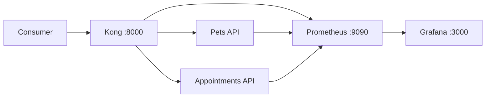

# API Gateway Platform Lab

This project extends my existing REST API experience into API gateway and platform engineering. It brings two TypeScript/Express services behind a shared Kong gateway and applies authentication, rate limiting, request correlation, health checks and basic observability.

The platform runs locally with Docker Compose and uses Prometheus and Grafana for metrics and monitoring. Its scope is intentionally focused on gaining practical experience with how APIs are routed, protected, monitored and troubleshot after development.

## Why this exists

My earlier API work focused on application endpoints, authentication and frontend/backend communication. This project extends that to the gateway layer, where multiple services share a single entry point and consistent policies.

Kong centralizes routing, API-key authentication, rate limiting and request IDs, allowing the pets and appointments services to remain focused on their domain responsibilities. Prometheus collects metrics from the platform, while Grafana provides a visual overview.




## What I implemented and tested

| Area | What I implemented |
|---|---|
| Routing | Kong directs `/api/pets` and `/api/appointments` to the correct service |
| Authentication | Requests require a demonstration API key |
| Rate limiting | Each service permits 20 requests per minute |
| Request tracking | Kong adds an `X-Request-ID` to proxied requests |
| Health | Each backend service exposes a health endpoint |
| Metrics | Prometheus collects metrics from Kong and both services |
| Visualization | Grafana displays gateway and service request metrics |
| Testing | API tests check important service responses |
| Automation | GitHub Actions runs tests, builds the services, and validates Compose |
| Failure exercise | Stopping one service demonstrates an isolated upstream failure |

## Run locally

Requirements: Docker Desktop with the Linux container engine running.

```powershell
docker compose up --build -d
docker compose ps
./scripts/smoke-test.ps1
```

Call an API through the gateway:

```powershell
Invoke-RestMethod http://localhost:8000/api/pets -Headers @{ apikey = "demo-api-key" }
```

Create a pet through the same gateway route:

```powershell
Invoke-RestMethod http://localhost:8000/api/pets `
  -Method Post `
  -Headers @{ apikey = "demo-api-key" } `
  -ContentType "application/json" `
  -Body '{"name":"Bella","species":"dog"}'
```

Pet and appointment data is stored in memory to keep the project focused on the gateway. Restarting a service resets its data.

Useful local endpoints:

- Kong proxy: `http://localhost:8000`
- Prometheus: `http://localhost:9090`
- Grafana: `http://localhost:3000` (`admin` / `admin`, local demo only)

Stop the platform with `docker compose down`.

## Expected gateway behavior

- No API key returns `401 Unauthorized`.
- A valid demo key (`demo-api-key`) permits the request.
- More than 20 requests in one minute returns `429 Too Many Requests`.
- Every proxied response includes `X-Request-ID`.
- If one upstream service stops, the other route continues working.

## Repository map

```text
services/       TypeScript domain APIs
infra/kong/     Declarative routes, consumers, and plugins
infra/prometheus/ Metrics collection configuration
infra/grafana/  Provisioned Prometheus data source
openapi/        Consumer-facing API contract
scripts/        Repeatable smoke test
docs/           Architecture, onboarding, and incident reasoning
```

## Tests without Docker

```powershell
npm install
npm test
npm run build
```

The service tests cover health responses, missing resources, valid pet creation, and invalid input. The smoke test checks authentication, request IDs, both gateway routes, and a write request through Kong.

## Design decisions and operational notes

The [implementation notes](docs/learning-notes.md) document troubleshooting findings from the Docker build, rate-limit validation and upstream failure testing. The [architecture notes](docs/architecture.md) explain the project’s use of database-less Kong, API-key authentication, local rate limiting and in-memory data, including the limitations of those choices.
The repository also includes an [API onboarding guide](docs/onboarding-a-service.md) outlining how another service could be added consistently, and an [incident runbook](docs/incident-runbook.md) covering investigation and recovery when an upstream service becomes unavailable.
This sounds confident and practical without suggesting professional production experience.

## Development approach

I developed and validated this project using technical documentation and AI-assisted tools for research and troubleshooting. I ran the complete platform locally, verified routing, authentication, rate limiting, request tracking and failure isolation, and resolved issues with container builds and configuration. I also documented the main design decisions, test results and current limitations.

## Platform verification
- Confirmed that Kong routes authenticated requests to the correct backend service.
- Verified 401 responses for missing credentials and 429 responses when the configured rate limit is exceeded.
- Confirmed that Kong generates an X-Request-ID that is available in the corresponding service logs.
- Simulated an upstream outage and verified that the affected route returned 503 while the other service remained available.
- Confirmed that Prometheus collects metrics from Kong and both services, with the results available through the Grafana dashboard.
- Automated service tests, TypeScript builds and Docker Compose validation through GitHub Actions.
  
## Next steps
- Replace the demonstration API key with an OAuth 2.0 or OpenID Connect flow.
- Add OpenTelemetry tracing to follow requests across the gateway and backend services.
- Deploy the platform to a local Kubernetes cluster to explore service discovery, readiness checks and scaling.
- Define basic alerts for elevated error rates and response latency.
