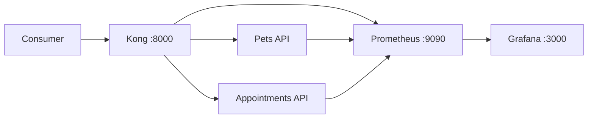

# Gateway Lab: a self-service API platform

A local platform engineering project that exposes two TypeScript services through a governed Kong API gateway. It demonstrates API routing, consumer authentication, rate limiting, correlation IDs, bounded timeouts and retries, metrics, service health, automated testing, and configuration-as-code onboarding.

> This is a learning project, not a claim to be production-ready. The documentation makes the trade-offs and production gaps explicit.

## Why this exists

Application developers should be able to publish APIs through a consistent, secure entry point without every team reinventing cross-cutting concerns. In this project, Kong applies shared policies while the domain services remain focused on pets and appointments.



## Capabilities

| Platform concern | Implementation |
|---|---|
| One API entry point | Kong routes `/api/pets` and `/api/appointments` |
| Consumer access | Kong key authentication |
| Traffic protection | Per-service rate limit of 20 requests/minute |
| Troubleshooting | `X-Request-ID` plus structured service logs |
| Reliability | Health checks, bounded timeouts, and limited retries |
| Observability | Kong and Node.js metrics scraped by Prometheus |
| Developer experience | OpenAPI contract and configuration-as-code onboarding |
| Delivery confidence | Unit/API tests and GitHub Actions CI |
| Operations | Reproducible incident exercise and recovery checks |

## Run locally

Requirements: Docker Desktop with the Linux container engine running.

```powershell
docker compose up --build -d
docker compose ps
./scripts/smoke-test.ps1
```

Call an API through the gateway:

```powershell
Invoke-RestMethod http://localhost:8000/api/pets -Headers @{ apikey = "demo-api-key" }
```

Useful local endpoints:

- Kong proxy: `http://localhost:8000`
- Prometheus: `http://localhost:9090`
- Grafana: `http://localhost:3000` (`admin` / `admin`, local demo only)

Stop the platform with `docker compose down`.

## Expected gateway behavior

- No API key returns `401 Unauthorized`.
- A valid demo key (`demo-api-key`) permits the request.
- More than 20 requests in one minute returns `429 Too Many Requests`.
- Every proxied response includes `X-Request-ID`.
- If one upstream service stops, the other route continues working.

## Repository map

```text
services/       TypeScript domain APIs
infra/kong/     Declarative routes, consumers, and plugins
infra/prometheus/ Metrics collection configuration
infra/grafana/  Provisioned Prometheus data source
openapi/        Consumer-facing API contract
scripts/        Repeatable smoke test
docs/           Architecture, onboarding, and incident reasoning
```

## Tests without Docker

```powershell
npm install
npm test
npm run build
```

## Engineering decisions and learning

The [architecture notes](docs/architecture.md) explain why the demo uses database-less Kong, API keys, local rate limiting, and in-memory domain data. The [self-service guide](docs/onboarding-a-service.md) shows how another team would propose an API as code. The [incident runbook](docs/incident-runbook.md) turns an upstream failure into a structured troubleshooting exercise.

## Production improvements

- Replace demo API keys with an identity-provider-backed OAuth/OIDC flow.
- Store credentials in a secret manager and rotate them.
- Run multiple gateway and service instances on Kubernetes.
- Use distributed tracing through OpenTelemetry.
- Add SLO-based alerts for error rate and latency.
- Validate gateway and OpenAPI configuration in CI.
- Use a shared or intentionally distributed rate-limit policy.
- Add TLS, network policies, vulnerability scanning, and signed images.

