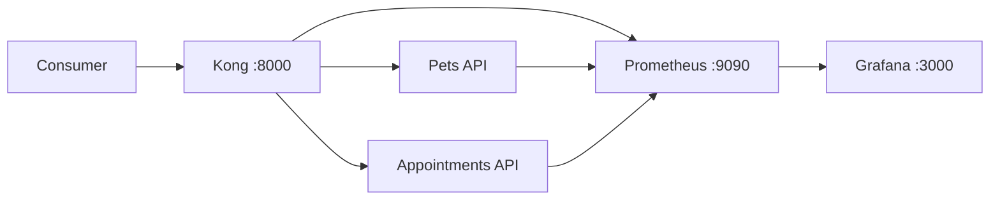

# API Gateway Learning Lab

I built this project to develop my understanding of API gateways and platform engineering.

My previous projects gave me experience developing and consuming REST APIs with Node.js, Express, and Flask. This project takes the next step: exploring how two backend services can be exposed through a shared gateway with authentication, rate limiting, request IDs, health checks, and basic observability.

The project runs locally with Docker Compose and uses Kong, Prometheus, and Grafana. It is a learning environment rather than a production-ready platform. My goal is to understand some of the responsibilities surrounding APIs after they have been developed.

## Why this exists

Most of my earlier API work focused on application endpoints, authentication, and frontend/backend communication. I wanted to learn what happens when multiple APIs need a shared entry point and common rules. In this project, Kong handles those shared rules while the two small services remain focused on their own data.



## What I implemented and tested

| Area | What I implemented |
|---|---|
| Routing | Kong directs `/api/pets` and `/api/appointments` to the correct service |
| Authentication | Requests require a demonstration API key |
| Rate limiting | Each service permits 20 requests per minute |
| Request tracking | Kong adds an `X-Request-ID` to proxied requests |
| Health | Each backend service exposes a health endpoint |
| Metrics | Prometheus collects metrics from Kong and both services |
| Visualization | Grafana displays gateway and service request metrics |
| Testing | API tests check important service responses |
| Automation | GitHub Actions runs tests, builds the services, and validates Compose |
| Failure exercise | Stopping one service demonstrates an isolated upstream failure |

## Run locally

Requirements: Docker Desktop with the Linux container engine running.

```powershell
docker compose up --build -d
docker compose ps
./scripts/smoke-test.ps1
```

Call an API through the gateway:

```powershell
Invoke-RestMethod http://localhost:8000/api/pets -Headers @{ apikey = "demo-api-key" }
```

Useful local endpoints:

- Kong proxy: `http://localhost:8000`
- Prometheus: `http://localhost:9090`
- Grafana: `http://localhost:3000` (`admin` / `admin`, local demo only)

Stop the platform with `docker compose down`.

## Expected gateway behavior

- No API key returns `401 Unauthorized`.
- A valid demo key (`demo-api-key`) permits the request.
- More than 20 requests in one minute returns `429 Too Many Requests`.
- Every proxied response includes `X-Request-ID`.
- If one upstream service stops, the other route continues working.

## Repository map

```text
services/       TypeScript domain APIs
infra/kong/     Declarative routes, consumers, and plugins
infra/prometheus/ Metrics collection configuration
infra/grafana/  Provisioned Prometheus data source
openapi/        Consumer-facing API contract
scripts/        Repeatable smoke test
docs/           Architecture, onboarding, and incident reasoning
```

## Tests without Docker

```powershell
npm install
npm test
npm run build
```

## Engineering decisions and learning

The [architecture notes](docs/architecture.md) explain why the demo uses database-less Kong, API keys, local rate limiting, and in-memory domain data. The [self-service guide](docs/onboarding-a-service.md) shows how another team would propose an API as code. The [incident runbook](docs/incident-runbook.md) turns an upstream failure into a structured troubleshooting exercise.

## Production improvements

- Replace demo API keys with an identity-provider-backed OAuth/OIDC flow.
- Store credentials in a secret manager and rotate them.
- Run multiple gateway and service instances on Kubernetes.
- Use distributed tracing through OpenTelemetry.
- Add SLO-based alerts for error rate and latency.
- Validate gateway and OpenAPI configuration in CI.
- Use a shared or intentionally distributed rate-limit policy.
- Add TLS, network policies, vulnerability scanning, and signed images.
