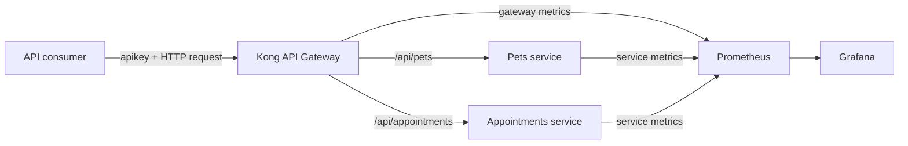

# Architecture

## Request lifecycle

1. A consumer sends a request to Kong, the only public API entry point.
2. Kong creates or propagates an `X-Request-ID` correlation identifier.
3. The key-auth plugin checks the consumer's API key.
4. The rate-limiting plugin enforces the consumer quota.
5. Kong matches the route and forwards the request to the appropriate service.
6. The service writes a structured log containing the request ID and returns a consistent JSON response.
7. Prometheus scrapes gateway and service metrics; Grafana queries Prometheus.

## Deliberate trade-offs

- **Database-less Kong:** Declarative configuration is version-controlled, reviewable, and simple to reproduce. A larger platform would likely use a controlled delivery process and external secret management.
- **Local rate-limit counters:** Appropriate for a one-node demonstration. A multi-node deployment needs a shared strategy, such as Redis, to avoid inconsistent quotas.
- **API keys:** They make gateway policy visible without adding an identity provider. Production user authentication would normally use OAuth 2.0 or OpenID Connect.
- **In-memory data:** The project focuses on platform behavior rather than database design. Restarting a service resets its data.
- **Direct service metrics:** Prometheus can access internal service endpoints, while clients can only reach business APIs through Kong.

